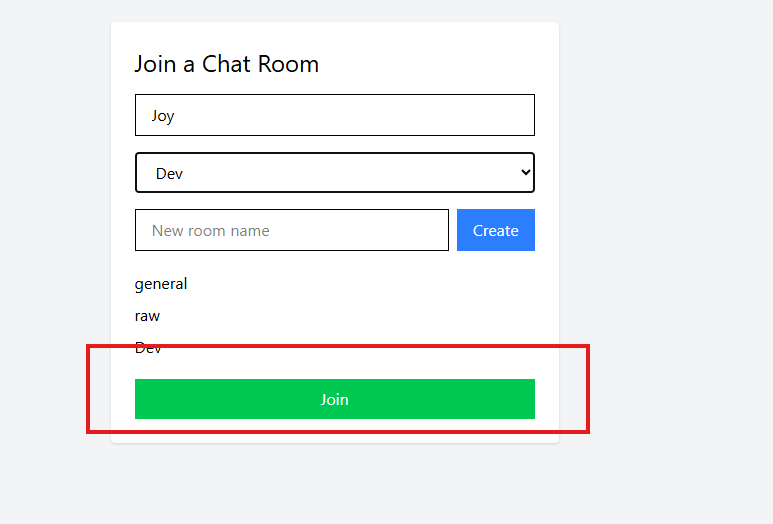
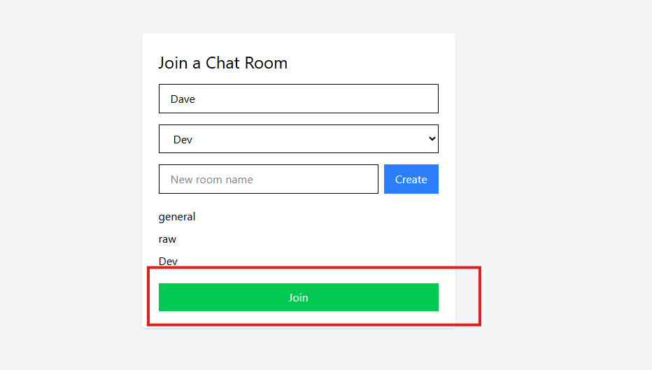
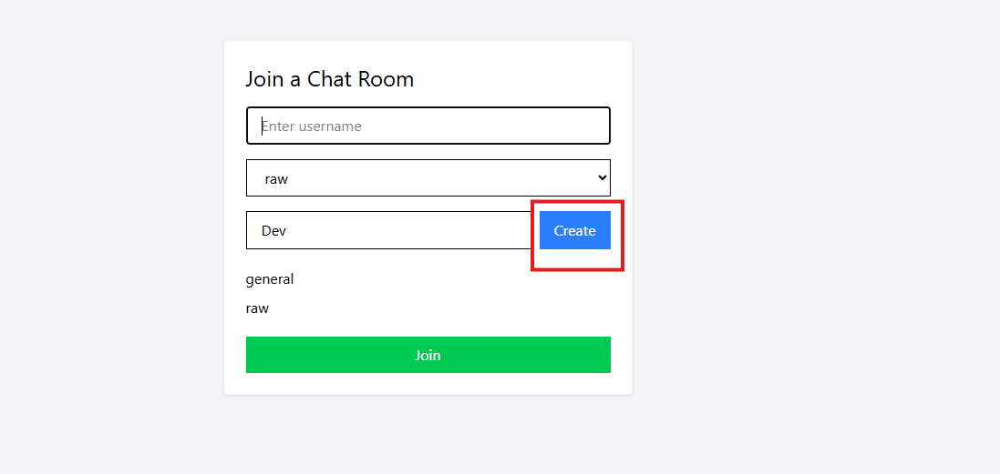
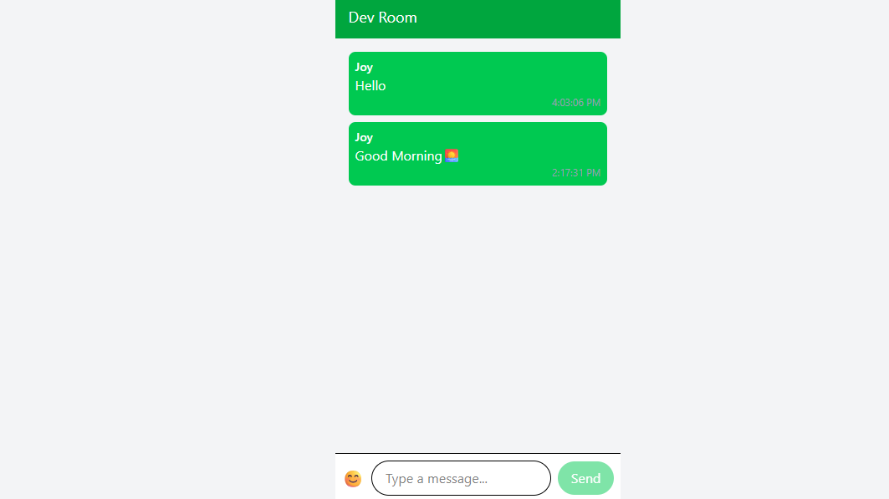

# Chat Application

## 📝 Introduction

This chat application provides real-time messaging with **Socket.io**, persistent storage using **MongoDB**, and a **React-based frontend**. Designed for local development in VS Code, it supports room creation, user joining, and interactive chatting with emoji support.

---

## 🚀 Features

- ⚡ Real-time messaging using Socket.io  
- 🔐 Room creation and selection for private chats  
- 👤 User authentication with username input  
- 🗃️ Persistent message storage using MongoDB  
- 😊 Emoji integration for expressive communication  
- ✍️ Typing indicator to show active users  

---

## 🛠 Installation

Follow these steps to set up the project locally in **VS Code**:

### 1. Clone the repository

```bash
git clone https://github.com/PLP-MERN-Stack-Development/week-5-web-sockets-assignment-Jepkosgei3.git
cd week-5-web-sockets-assignment-Jepkosgei3
````

### 2. Install server dependencies

```bash
cd server
pnpm install
```

**Required packages:**

* `express`
* `http`
* `cors`
* `socket.io`
* `mongoose`
* `dotenv`

### 3. Install client dependencies

```bash
cd ../client
pnpm install
```

**Required packages:**

* `react`
* `react-dom`
* `socket.io-client`
* `axios`
* `@emoji-mart/react`
* `@emoji-mart/data`

### 4. Set up environment variables

**server/.env**

```
MONGO_URI=mongodb://127.0.0.1:27017/chatapp
PORT=4000
```

**client/.env**

```
VITE_SOCKET_URL=http://localhost:4000
```

---

## ▶️ Running the App

### Start the server

```bash
cd server
pnpm run dev
```

### Start the client

```bash
cd ../client
pnpm run dev
```

**Client runs at:** [http://localhost:5173](http://localhost:5173)

---

## 💬 Usage

* **Joining:** Enter a username and select or create a room to join.
* **Creating a Room:** Input a new room name and click “Create” to start a chat.
* **Chatting:** Send messages, use emojis, and view typing indicators.

---

## 📸 Screenshots

### 🧍 Joining Screenshot





### ➕ Creating a Room Screenshot



### 💬 Chatting Screenshot




---

## 🧩 Troubleshooting

* **CORS Errors:** Ensure `VITE_SOCKET_URL` in `client/.env` is `http://localhost:4000`.
* **Connection Issues:** Make sure MongoDB is running locally at `mongodb://127.0.0.1:27017`, and `MONGO_URI` is correct.
* **Missing Packages:** Re-run `pnpm install` in both `server` and `client`.

---

## 🤝 Contributing

Contributions are welcome! To contribute:

1. Fork the repository.

2. Create a new branch:

   ```bash
   git checkout -b feature-name
   ```

3. Commit your changes:

   ```bash
   git commit -m "Add feature"
   ```

4. Push to GitHub:

   ```bash
   git push origin feature-name
   ```

5. Open a pull request.

---

## 📄 License

Distributed under the **MIT License**. See `LICENSE` for details.

```

### ✅ To use this:
1. Place your screenshot images in the project’s root under `/images`.
2. Name them:
   - `joining.png`
   - `creating-room.png`
   - `chatting.png`
3. Commit the `images` folder along with the README.

Let me know if you’d like to add GIFs, embed video demos, or adjust image layout for GitHub Pages!
```
